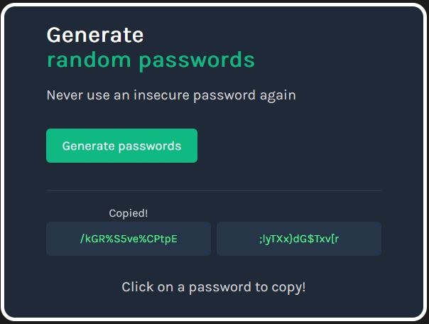

# Password Generator

## Overview

The user will be able to:

-   Generate two passwords of 15 long alphanumeric characters.
-   The passwords can be copied to the clipboard by clicking on them, an animation with displayed with a "Copied!" message.

This project was designed to work on small and big screens.

## Quickstart

To run this repo you will need to install:

-   git
    -   After installing the package run in ths terminal the command `git --version`, if the installation was successful the ouput should look liks this: `git version x.xx.x.windows.x`. Download [here](https://git-scm.com/).
-   Node Js
    -   After the installation run the command `node --versio`n, if the ouput looks like `vxx.xx.x` it means the installation was successful. Download [here](https://nodejs.org/en/).
-   Live Server
    -   With this extension you will be able to launch development local Server. Download [here](https://marketplace.visualstudio.com/items?itemName=ritwickdey.LiveServer).

Initialize git, clone the repo and cd into the folder:

```
git init
git clone
cd password-generator
```

To install the dependecies run:

```
Yarn
```

## Screenshots

<div align="center">
    
</div>

## New concepts learned and applied

-   [Variable declaration](https://developer.mozilla.org/en-US/docs/Learn/JavaScript/First_steps/Variables)
    -   [types of variables](https://developer.mozilla.org/en-US/docs/Learn/JavaScript/First_steps/Variables#variable_types)
    -   [let](https://developer.mozilla.org/en-US/docs/Web/JavaScript/Reference/Statements/let)
    -   [const](https://developer.mozilla.org/en-US/docs/Web/JavaScript/Reference/Statements/const)
-   [Function](https://developer.mozilla.org/en-US/docs/Web/JavaScript/Guide/Functions)
-   [Loops and iteration](https://developer.mozilla.org/en-US/docs/Web/JavaScript/Guide/Loops_and_iteration)
-   [Return statement](https://developer.mozilla.org/en-US/docs/Web/JavaScript/Reference/Statements/return)
-   [Document.getElementById()](https://developer.mozilla.org/en-US/docs/Web/API/Document/getElementById)
-   [Node.appendChild()](https://developer.mozilla.org/en-US/docs/Web/API/Node/appendChild)
-   [Element.classList](https://developer.mozilla.org/en-US/docs/Web/API/Element/classList)
-   [Math.random()](https://developer.mozilla.org/en-US/docs/Web/JavaScript/Reference/Global_Objects/Math/random)
-   [Math.floor()](https://developer.mozilla.org/en-US/docs/Web/JavaScript/Reference/Global_Objects/Math/floor)
-   [Element.remove()](https://developer.mozilla.org/en-US/docs/Web/API/Element/remove)
-   [@keyframes](https://developer.mozilla.org/en-US/docs/Web/CSS/@keyframes)
-   [@media](https://developer.mozilla.org/en-US/docs/Web/CSS/@media)

## Acknowledgements 😎 🙌

I want to thanks [Scrimba](https://scrimba.com/) and their team for teaching me the necessary tools to complete this project in my journey to become a full stack developer.

## Thank you!🎉 🎉

I hope you like this project and it ends up being useful to you 👨‍💻
